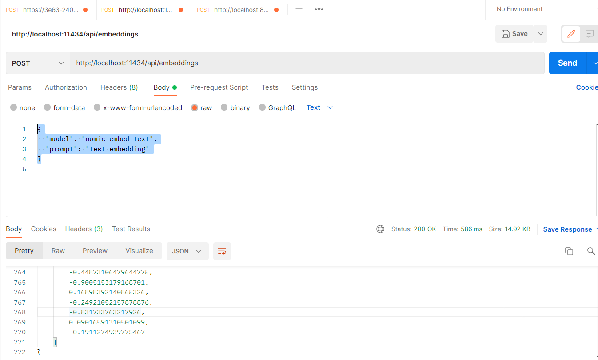
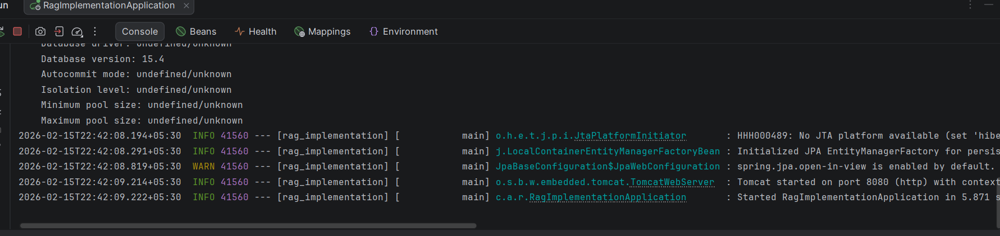
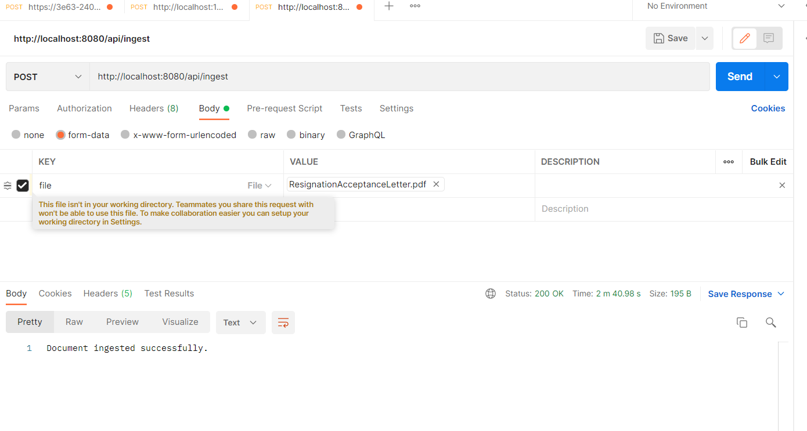
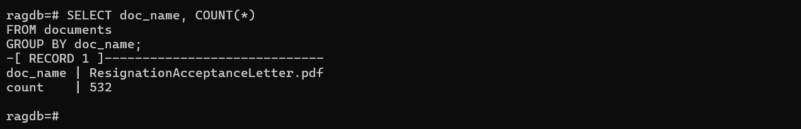

1. Create docker container Network
   docker network create rag-network

2. Create POSTGRESS_DB and run on port 5432
   docker run -d --name pgvector-db -e POSTGRES_USER=postgres -e POSTGRES_PASSWORD=postgres -e POSTGRES_DB=ragdb -p 5432:5432 ankane/pgvector

3. Install pgvector for storing embeddings vector
   docker exec -it pgvector-db psql -U postgres -d ragdb

4. Create and Run Ollama
   docker run -p 11434:11434 ollama/ollama:latest

5. Install embedding model inside the Ollama
   docker exec -it ollama ollama pull nomic-embed-text

6. Verify embedding model 
   docker exec -it ollama ollama list

7. Attach container to the network 
   docker network connect rag-network pgvector-db
   docker network connect rag-network ollama

8. Create vector extension inside the postgress vector database 
   CREATE EXTENSION vector;

9. Create table

CREATE TABLE documents (
id SERIAL PRIMARY KEY,
doc_name TEXT,
chunk_index INT,
content TEXT,
embedding VECTOR(768),
created_at TIMESTAMP DEFAULT CURRENT_TIMESTAMP
);

Note: select vector dimension based on embedding model dimension, in my case it is 768.
The dimension should be same otherwise it will be give the insertion error.

10. Check status with below command

| Command                    | What it does         |
| -------------------------- | -------------------- |
| `\l`                       | Show all databases   |
| `\c ragdb`                 | Connect to database  |
| `\dt`                      | Show tables          |
| `\d documents`             | Show table structure |
| `SELECT * FROM documents;` | View table data      |
| `\q`                       | Exit psql            |

11. Start and stop pgvector
docker stop pgvector
docker start pgvector

12. Verify embedding model using curl

http://localhost:11434/api/embeddings
POST'{
"model": "nomic-embed-text",
"prompt": "test embedding"
}'

Embedding Models Verification:

Spring boot application running on 8080 port on windows

Console logs : Output 

Document Ingestion Logs:

Ingestion into database

